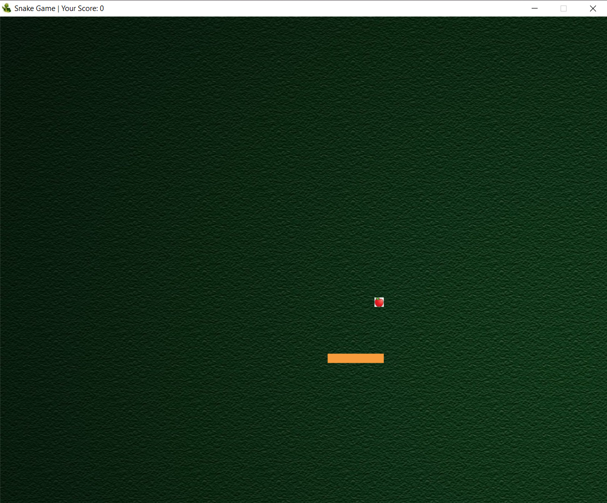
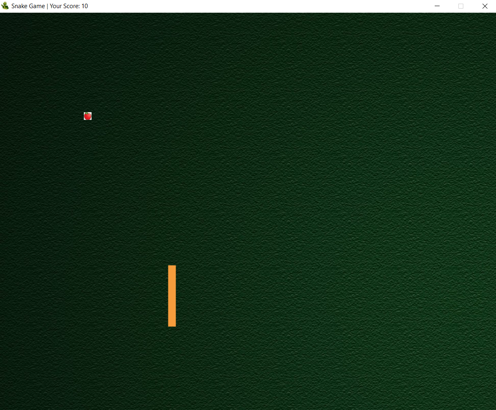
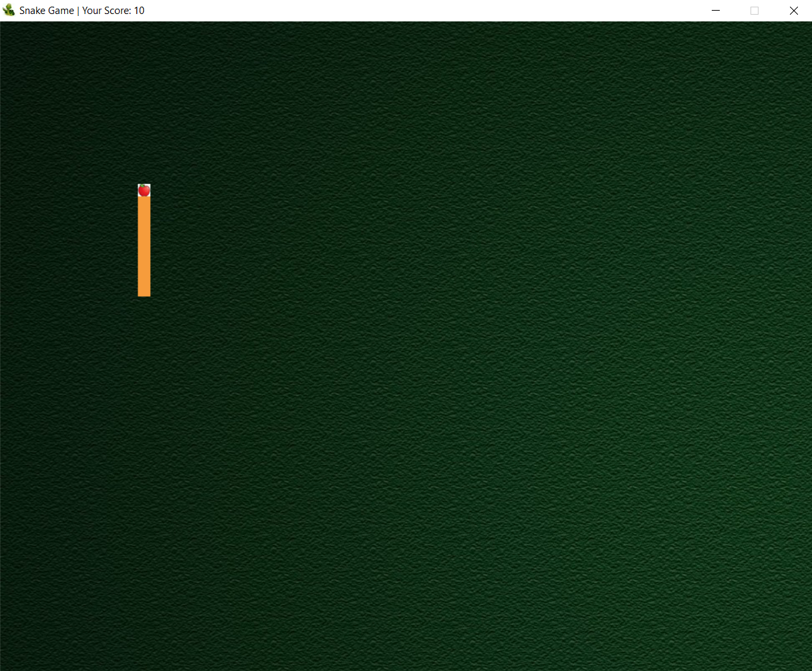
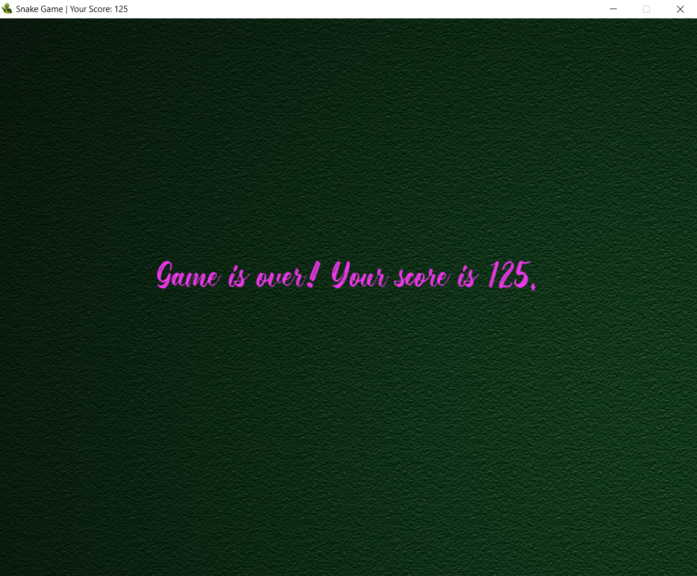

# Snake-Game-Python 

## This a snake game 🐍 I made using Pygame

Run this game by running  ```./snake_game/src/snake.py``` or ```python3 snake_game/src/snake.py``` in the terminal.

Here are some of the shots of my game 😄









Clone it, fork it and play my game 💞❤

~Souvik
